# OpEx Intelligence Platform — Architecture Documentation

**Version:** 3.0 | **Last Updated:** May 2026 | **Stack:** FastAPI · Python 3.11 · Claude LLM · OPAR Loop

**Audience:** Technical architects, platform engineers, security teams, business stakeholders

---

## Executive Summary

The **OpEx Intelligence Platform** is an agentic cost-reduction engine designed for Indian enterprises to identify and quantify operating expenditure (OpEx) savings opportunities. Rather than point-in-time analysis, the platform orchestrates an iterative Observe-Plan-Act-Reflect (OPAR) loop, powered by Claude AI and 26 modular skills, to synthesize cost insights from spend data, peer benchmarks, and regulatory intelligence.

**Key Value Props:**
- **Speed:** From data upload to board-ready business case in 2–4 hours (vs. weeks with traditional consulting)
- **India-First Design:** Data residency in ap-south-1/centralindia, GST/PF/statutory compliance, 11 industry-specific sector packs (BFSI, Manufacturing, IT/ITeS, FMCG, Pharma, Energy, Insurance, Retail, Telecom, PSU, Conglomerate)
- **Security by Default:** B1–B4 data classification, PII detection (≥99.2% recall), AES-256 encryption, immutable audit log with hash chain
- **Extensibility:** Skill-based architecture allows rapid addition of new capabilities without modifying core orchestration
- **Multi-Mode LLM Deployment:** Choose M1 (deterministic), M2 (cloud India region, zero-retention), or M3 (on-prem Ollama) per engagement

---

## How to Read This Document

**Choose your path based on time and role:**

### **Path A — Executive / Business Decision-Maker (5 minutes)**
→ Read: Executive Summary · Use Cases (§ 1A) · Section Summaries at end of each technical section

**Goal:** Understand how the platform solves cost reduction and whether it fits your needs.

### **Path B — Business Analyst / Product Owner (30 minutes)**
→ Read: Executive Summary · § 1 (System Context) · § 3 (OPAR Loop) · § 4 (Skill DAG) · § 6 (Security Architecture Summary)

**Goal:** Understand the system's business capabilities, who uses it, and how data flows.

### **Path C — Architect / Engineer / Security Team (2–3 hours)**
→ Read: Full document (all sections) with deep-dives into technical components

**Prereq Knowledge:** Familiarity with microservices, API design, data classification, and LLM concepts helpful but not required.

---

## Table of Contents

| Section | Topic | Read Time |
|---------|-------|-----------|
| Exec Summary | Value props, India-first design, key features | 3 min |
| **1** | System Context & Stakeholders | 5 min |
| **1A** | Common Workflows — Use Cases | 10 min |
| **2** | System Overview — Functional Blocks | 8 min |
| **3** | OPAR Loop — How It Works | 10 min |
| **4** | Skill DAG — 26 Skills in 8 Groups | 8 min |
| **5** | LLM Providers — M1/M2/M3 Modes | 7 min |
| **6** | Security Architecture | 10 min |
| **7** | Data Model | 8 min |
| **8** | Sector Pack Architecture | 10 min |
| **9** | Addressability Engine — 4-Dimension Model | 10 min |
| **10** | Lever Intelligence Engine | 12 min |
| **11** | Sensitivity Analysis — 7 Scenarios | 5 min |
| **12** | Scale Tiers (Mid-Cap, Large-Cap, Conglomerate) | 6 min |
| **13** | Deployment Architectures | 8 min |
| **Appendices** | Reference material, glossary, lifecycle | As needed |

---

## 1. System Context & Stakeholders

**Why This Matters:** To understand how OpEx Intelligence solves cost reduction, you need to know who's using it, where the data lives, and how it connects to your regulatory/compliance environment. This section maps those relationships.

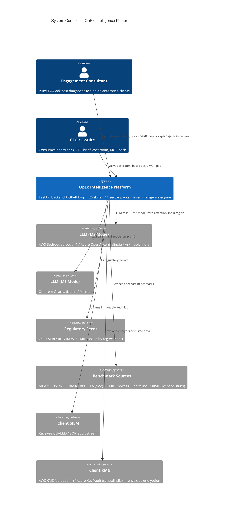

**Fig. 1 — System Context Diagram**

> **Key Insight:** All data stays in India (ap-south-1 or centralindia) with zero-retention LLM calls—critical for RBI and data sovereignty compliance.

---

## 1A. Common Workflows — How OpEx Intelligence Solves Real Problems

**Why This Matters:** These concrete examples show how the architecture translates into business value. Each workflow demonstrates a different use case the platform enables.

### **Workflow 1: Spend Discovery & Peer Benchmarking**

**Scenario:** A 3,000-person financial services company uploads its annual spend (₹500 Cr, 50k transactions) to understand cost position vs. peers.

**Flow:**
1. **Upload** → `POST /api/upload/{session_id}` with CSV/Excel containing supplier, category, amount, cost center
2. **OPAR Observe** → Detects industry as BFSI (keyword scanning on category names, historical GL codes)
3. **OPAR Plan** → DAG optimizer determines optimal skill sequence:
   - Group 0 (Security) — PII stripper detects supplier PII, classifies as B2
   - Group 1 (Data Foundation) — Spend profiler applies 4-dim addressability model
   - Group 2 (Benchmarking) — Peer benchmarker fetches MCA21 + CMIE Prowess data, compares percentiles
4. **OPAR Act** → All skill groups execute in parallel
5. **OPAR Reflect** → Quality gate validates output; if AssumptionQualityScore ≥ 0.65, promotes to Gate-2
6. **Output** → Dashboard shows 12 categories, peer comparison (P25/P50/P75), 4 cost anomalies flagged
7. **Time:** 2 hours from upload to insights

**Key Components Used:** § 2 (System Overview), § 3 (OPAR Loop), § 4 (Skill DAG Groups 0–2), § 6 (Security)

---

### **Workflow 2: Value Lever Identification & Business Case**

**Scenario:** Same BFSI client wants to quantify savings potential. Finance team needs phased roadmap (12M, 24M, 36M targets).

**Flow:**
1. **Accept** → Consultant approves upload from Workflow 1
2. **OPAR Plan** → Skill DAG expands to include Groups 3–5:
   - Group 3 (Analysis) — Root cause analyzer identifies that MRO (Materials/Repairs) is 2× peer median → "MRO consolidation" lever triggered
   - Group 4 (India Tax) — Indian-tax-optimizer flags IT outsourcing category for 18% GST optimization
   - Group 5 (Financial Modeling) → Savings-modeler calculates P50 savings per lever, confidence bands, phasing
3. **Lever Intelligence** → `resolve_eligible_levers()` merges BFSI sector pack (8 levers) + universal 30+ levers → ranks by eligibility score
   - Top initiatives: MRO consolidation (₹15 Cr run-rate), IT contract renegotiation (₹8 Cr), GST ITC recovery (₹3 Cr)
4. **Scenario Modeling** → Sensitivity engine runs 7 scenarios (conservative 60%, base 80%, accelerated 90%, etc.)
5. **Output** → Business case document with NPV (tax-adjusted), payback period, bounce-back risk, condition precedents
6. **Time:** 30 minutes (mostly data processing; skills already ran in Workflow 1)

**Key Components Used:** § 3 (OPAR Loop), § 8 (Sector Pack Architecture), § 9 (Addressability Engine), § 10 (Lever Intelligence), § 11 (Sensitivity)

---

### **Workflow 3: Pipeline Management & Execution Tracking**

**Scenario:** CFO accepts 3 initiatives for execution. Team tracks progress over 12M, compares actual vs. planned.

**Flow:**
1. **Accept** → `PUT /api/v1/initiatives/{id}/stage` (accept/reject) — logged to immutable audit log
2. **Milestone Tracking** → `POST /api/v1/initiatives/{id}/milestones` — monthly progress updates
3. **Actuals Ingestion** → `POST /api/v1/initiatives/{id}/actuals` (T+6M) — realised savings for first half
4. **Variance Analysis** → Calibration pipeline (`app/services/calibration.py`) compares P50 estimate vs. realised
   - If realisation rate ≥ 80%: auto-approve lever-range update
   - If 60–80%: senior review recommended
   - If < 60%: deep audit required
5. **Pack Version Update** → `apply_version_bump()` updates sector pack with refined P10/P50/P90 ranges
6. **Output** → Calibration report + updated pack version (v1.0 → v1.1)
7. **Time:** Ongoing; calibration cycle every 12M post-engagement

**Key Components Used:** § 8 (Sector Packs), § 13 (Engagement Lifecycle — Calibration)

---

### **Workflow 4: Compliance & Audit Trail**

**Scenario:** Regulatory audit requests evidence that OpEx Intelligence output is compliant, auditable, and free of sensitive data leakage.

**Flow:**
1. **Data Classification** → On upload, PII stripper identifies PII with ≥99.2% recall (Presidio + spaCy + Indian-name NER)
2. **Band Enforcement** → B4 (PII) automatically quarantined; B1–B3 proceeds through pipeline
3. **Skill-Output Re-classification** → Each skill output re-classified at boundary (bands.py)
   - If output accidentally exposes PII → quarantine + audit log + escalation alert
4. **Audit Log Streaming** → Every event (upload, skill execution, initiative accept/reject, tear-down) appended to append-only file with SHA-256 hash chain
5. **SIEM Integration** → Audit log streamed to client SIEM in CEF/LEEF format within 60 seconds
6. **Tear-Down** → Post-engagement, execute 9-step tear-down (infrastructure, memory, backups, DLP checks)
7. **Attestation** → Generate signed attestation: "zero_residual_confirmed" — audit trail persists, engagement data deleted
8. **Time:** Tear-down 15 minutes + manual DLP check (< 1 hour total)

**Key Components Used:** § 6 (Security), § 13 (Deployment & Tear-Down), Appendix C (Engagement Lifecycle)

---

**Section Summary:**
- Four concrete workflows demonstrate platform capabilities across cost discovery, value quantification, execution tracking, and compliance
- Each workflow maps to specific architectural components (OPAR, Skills, Sector Packs, Audit Log)
- Workflows span 2-hour quick analysis to 12-month calibration cycles

**Next:** § 2 details the system's functional blocks and how they interact.

---

## 2. System Overview — Functional Blocks

**Why This Matters:** Rather than drilling into individual components, this section shows how the major building blocks work together. Think of it as "what talks to what and why."

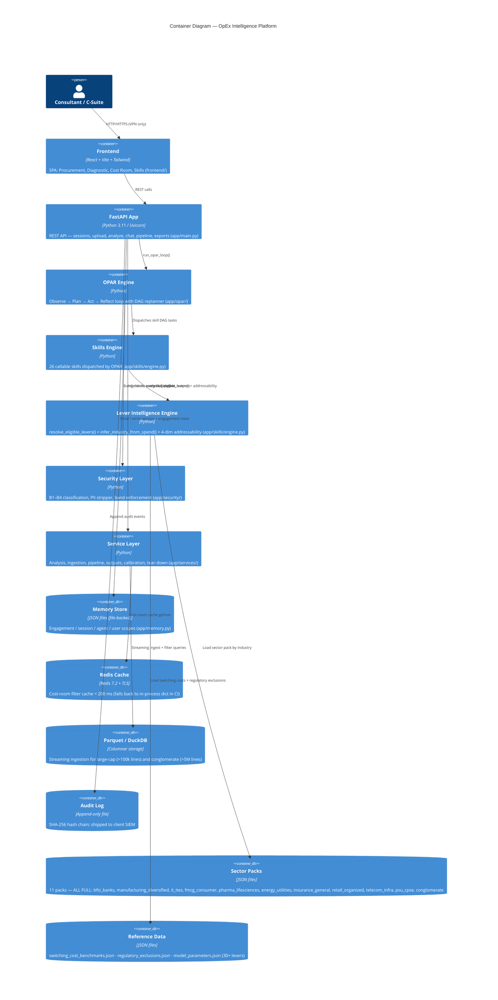

**Fig. 2 — System Overview: Functional Blocks & Interactions**

> **Key Insight:** The OPAR Engine is the orchestrator. It never makes decisions directly—instead, it plans a skill execution DAG, runs skills in parallel groups, and validates outputs against quality gates.

**Functional Blocks Explained:**

| Block | Role | Manages |
|-------|------|---------|
| **Frontend** | User interface for data upload, cost room filtering, initiative acceptance/rejection | Dashboard state, API calls |
| **FastAPI App** | REST endpoint handler; session/engagement lifecycle | Routing, middleware, auth tokens |
| **OPAR Engine** | Orchestrator—plans skill DAG, dispatches skills, validates outputs | Observe, Plan, Act, Reflect phases |
| **Skills Engine** | Library of 26 callable operations (profiling, analysis, modeling, output generation) | Skill execution, caching, mode-aware calls |
| **Lever Intelligence** | Resolves eligible cost levers per industry, scores by eligibility, feeds savings-modeler | Industry inference, lever eligibility, 4-dim addressability |
| **Security Layer** | PII detection, data classification (B1–B4), band enforcement at skill boundaries | Classification, quarantine, audit log |
| **Service Layer** | Domain logic: ingestion, analysis, pipeline (initiative tracking), outputs, calibration, tear-down | Business operations |
| **Memory Store** | Persistent JSON-based engagement/session/user context (optional Mem0 integration) | Cross-request state |
| **Redis Cache** | Cost-room filter cache, session state (optional; fallback to in-process dict) | < 200 ms filter latency |
| **Parquet / DuckDB** | Columnar storage for large spend datasets (>100k lines) | Streaming ingest, filter queries |
| **Audit Log** | Append-only file with SHA-256 hash chain; streamed to SIEM | Compliance, forensics, attestation |
| **Sector Packs** | 11 industry-specific lever libraries (BFSI, Manufacturing, IT, FMCG, Pharma, Energy, Insurance, Retail, Telecom, PSU, Conglomerate) | Industry-specific lever configuration |
| **Reference Data** | Universal lever parameters, switching costs, regulatory exclusions, cost behavior rules | Addressability, lever modeling |

**Section Summary:**
- 13 functional blocks work together in a client-to-database flow
- OPAR orchestrates; Skills execute; Security validates; Services coordinate business logic
- Data flows through Security layer on entry; re-classified at skill output boundaries

**Next:** § 3 deep-dives into the OPAR loop—the heartbeat of the platform.

---

## 3. How It Works: The OPAR Loop

**Why This Matters:** The OPAR loop is the heartbeat of our platform. Rather than one-shot analysis, OPAR orchestrates an iterative cycle of observation, planning, execution, and reflection—allowing the AI to refine recommendations as new data emerges. Understanding this cycle is key to understanding why the platform is powerful.

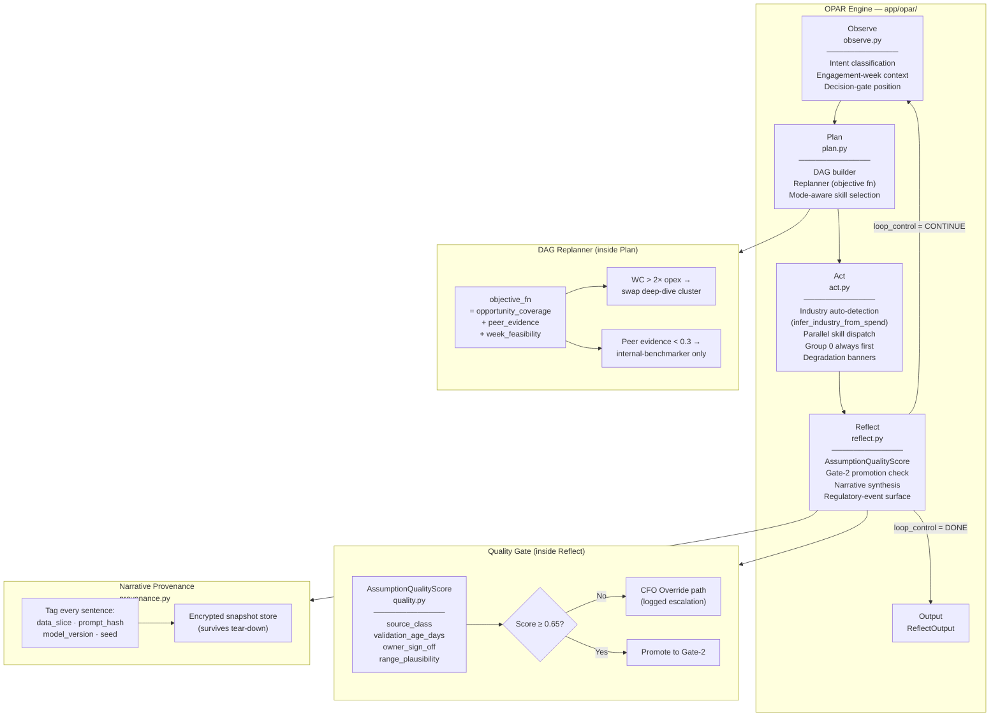

**Fig. 3 — OPAR Loop with Quality Gate & Provenance**

> **Key Insight:** OPAR can pivot mid-loop. If initial assumptions fail (AssumptionQualityScore < 0.65), Plan is regenerated before proceeding to Act.

**Phase 1: OBSERVE** (~5 min)
- **Intent Classification** — Is this a upload_data, benchmark, value_bridge, or business_case request?
- **Memory Retrieval** — Load prior session/engagement context from memory store
- **Data Quality Assessment** — Check schema, detect anomalies (zero spend categories, future dates, etc.)
- **Clarity Gates** — Assess whether data is sufficient to proceed (e.g., "Revenue unknown" → can't run peer benchmark)
- **Output:** `ObserveContext` with clarity decisions

**Phase 2: PLAN** (~10 min)
- **DAG Construction** — Claude-powered skill dependency resolution using `skills/_capability_matrix.json`
- **DAG Replanner** — Objective function considers opportunity_coverage, peer_evidence, week_feasibility; swaps skill clusters based on spend patterns
- **Mode Selection** — Check M1/M2/M3 capability matrix; if M2/M3 skills needed but only M1 available, plan includes degradation banner
- **User Preview** — Return plan to consultant for approval before execution
- **Output:** `ExecutionPlan` (skill DAG + dependencies + estimated runtime)

**Phase 3: ACT** (~30 min–2 hours depending on tier)
- **Industry Auto-Detection** — If industry not provided, infer from document signals (PDFs) or spend signals (category concentration, keyword scanning)
- **Group 0 First** — Security group always runs first (PII stripper, classifier, context builder)
- **Parallel Dispatch** — Groups 1–7 execute in parallel within dependency constraints
- **Degradation Handling** — If skill unavailable, mark as degraded in output (e.g., "peer-benchmarker unavailable in M1 mode")
- **Output:** `ActResult` with skill outputs + metadata

**Phase 4: REFLECT** (~10 min)
- **Schema Validation** — Validate every skill output against its contract schema (SkillIO class)
- **Quality Gate (Gate-2)** — Compute `AssumptionQualityScore` based on source_class, validation_age_days, owner_sign_off, range_plausibility
  - If score ≥ 0.65: Promote to Gate-2 (ready for CFO review)
  - If score < 0.65: CFO override path (escalation logged)
- **Narrative Provenance** — Tag every sentence with data_slice, prompt_hash, model_version; store encrypted snapshots
- **Regulatory Event Surfacing** — Check for GST updates, SEBI disclosure triggers, RBI guidance changes
- **Loop Control Decision** — Return CONTINUE (loop back to Observe for next hypothesis) or DONE (return output)
- **Output:** `ReflectOutput` + `loop_control`

**Section Summary:**
- Four-phase loop ensures iterative refinement of cost insights
- DAG Replanner allows dynamic skill sequencing based on spend patterns
- Quality gate prevents low-confidence output from reaching CFO
- Narrative provenance enables audit trail of every recommendation

**Next:** § 4 shows the 26 skills and how they're organized.

---

## 4. Skill DAG — 26 Skills in 8 Groups

**Why This Matters:** We've organized our 26 capabilities into 8 skill groups with explicit dependencies. This section shows the dependency graph and how each group contributes to the final analysis. The grouping enables parallel execution while respecting data flow constraints.

```mermaid
flowchart LR
    subgraph G0["Group 0 — Security (always first)"]
        PII["pii-stripper"]
        CLF["data-classifier"]
        LCB["llm-context-builder"]
        PII --> CLF --> LCB
    end

    subgraph G1["Group 1 — Data Foundation"]
        DV["data-validator"]
        SP["spend-profiler\n(4-dim addressability)"]
        DV --> SP
    end

    subgraph G2["Group 2 — Benchmarking"]
        PB["peer-benchmarker"]
        IB["internal-benchmarker"]
        PDM["peer-disclosure-miner"]
    end

    subgraph G3["Group 3 — Analysis"]
        HA["heuristic-analyzer"]
        RCA["root-cause-analyzer\n(+ eligible levers per category)"]
        BVA["bva-analyzer"]
        TA["temporal-analyzer"]
    end

    subgraph G4["Group 4 — India Tax & Compliance"]
        ITO["indian-tax-optimizer"]
        BRSR["brsr-cobenefit-calculator"]
    end

    subgraph G5["Group 5 — Financial Modelling"]
        SM["savings-modeler\n(industry-aware lever selection\n+ sustainability scores)"]
        PTO["payment-terms-optimizer"]
        AS["assumption-register"]
        SCM["scenario-modeler"]
    end

    subgraph G6["Group 6 — Value Translation"]
        VB["value-bridge-calculator"]
        VSB["value-to-shareholder-bridge"]
    end

    subgraph G7["Group 7 — Outputs"]
        CB["chart-builder"]
        DC["document-contextualizer\n(+ industry signal detection)"]
        AR["assumption-register\n(export)"]
    end

    G0 --> G1 --> G2
    G1 --> G3
    G2 --> G3
    G3 --> G4
    G3 --> G5
    G4 --> G5
    G5 --> G6
    G6 --> G7
```

**Fig. 4 — Skill Dependency DAG (26 Skills across 8 Groups)**

**Group Details:**

| Group | Skills | Purpose | Dependencies |
|-------|--------|---------|--------------|
| **0 — Security** | pii-stripper, data-classifier, llm-context-builder | Detect PII, band data (B1–B4), prepare LLM-safe context | (entry point) |
| **1 — Data Foundation** | data-validator, spend-profiler | Validate schema, apply 4-dim addressability model | Group 0 |
| **2 — Benchmarking** | peer-benchmarker, internal-benchmarker, peer-disclosure-miner | Peer percentiles (P25/P50/P75), cross-BU/geo comparison, regulatory disclosure mining | Group 1 |
| **3 — Analysis** | heuristic-analyzer, root-cause-analyzer, bva-analyzer, temporal-analyzer | Category anomalies, cost drivers, price/volume/mix variance, YoY/MoM/QoQ trends | Groups 1 & 2 |
| **4 — India Tax** | indian-tax-optimizer, brsr-cobenefit-calculator | GST optimization (ITC eligible, RCM, inverted duty), ESG co-benefits (carbon, water, waste) | Group 3 |
| **5 — Financial Modeling** | savings-modeler, payment-terms-optimizer, assumption-register, scenario-modeler | Lever selection + P50 savings, DPO extension, assumption registry, 7-scenario sensitivity | Groups 3 & 4 |
| **6 — Value Translation** | value-bridge-calculator, value-to-shareholder-bridge | Confidence bands, shareholder return mapping | Group 5 |
| **7 — Outputs** | chart-builder, document-contextualizer, export-formatter | Viz generation, document assembly, format conversion (DOCX, PDF, Excel) | Groups 5 & 6 |

**Section Summary:**
- 26 skills organized in 8 groups with explicit dependencies
- Group 0 (Security) always runs first; Groups 1–7 follow dependency graph
- Each skill is modular, versioned, testable; easy to extend

**Next:** § 5 explains LLM deployment modes (M1/M2/M3) and how skills select them.

---

## 5. LLM Providers — M1 / M2 / M3 Modes

**Why This Matters:** Different skills and different organizations have different requirements. M1/M2/M3 modes allow each engagement to pick the right balance between speed, cost, security, and compliance. This section shows how the choice cascades through skill execution.

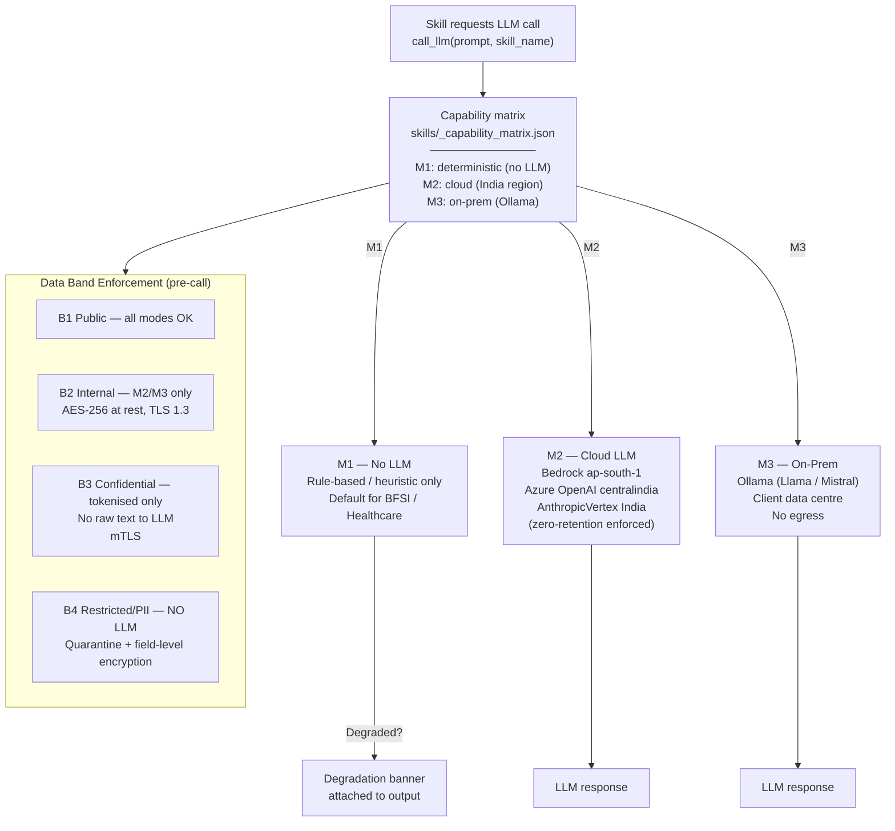

**Fig. 5 — LLM Mode Selection & Data Band Enforcement**

**Mode Profiles:**

| Mode | Technology | Data Residency | Latency | Security | Use Case |
|------|-----------|-----------------|---------|----------|----------|
| **M1 — Deterministic** | Rule-based, heuristic, regex | On-premise / client VPC | < 100 ms | No external calls | BFSI/Healthcare (no LLM allowed); fast path for low-uncertainty decisions |
| **M2 — Cloud (India)** | Claude (Bedrock ap-south-1, Azure OpenAI centralindia, Anthropic-India) | ap-south-1 / centralindia region | 500 ms–2 s | Zero-retention contract; TLS 1.3; B2/B3 only | Most engagements; balance of capability + security |
| **M3 — On-Prem** | Ollama (Llama 2, Mistral, etc.) | Client data centre | 1–5 s | No egress; client controls model updates | Highly regulated, on-prem-only clients; slower but maximum control |

**Data Band Enforcement (Pre-Call):**
- **B1 (Public):** All modes OK
- **B2 (Internal):** M2/M3 only; no external call in M1
- **B3 (Confidential):** Tokenized only (abstractions, indices, hash values); no raw text
- **B4 (Restricted/PII):** NO LLM; quarantine + field-level encryption

**Section Summary:**
- M1/M2/M3 modes allow flexibility in LLM deployment per engagement
- Data band enforcement prevents sensitive data leakage to LLM providers
- Capability matrix (`skills/_capability_matrix.json`) specifies which skills support which modes

**Next:** § 6 details the Security architecture and how data is protected throughout the pipeline.

---

## 6. Security Architecture

**Why This Matters:** Data classification and protection are not afterthoughts—they're baked into every phase of the platform. This section walks through PII detection, data banding, audit logging, and quarantine mechanisms.

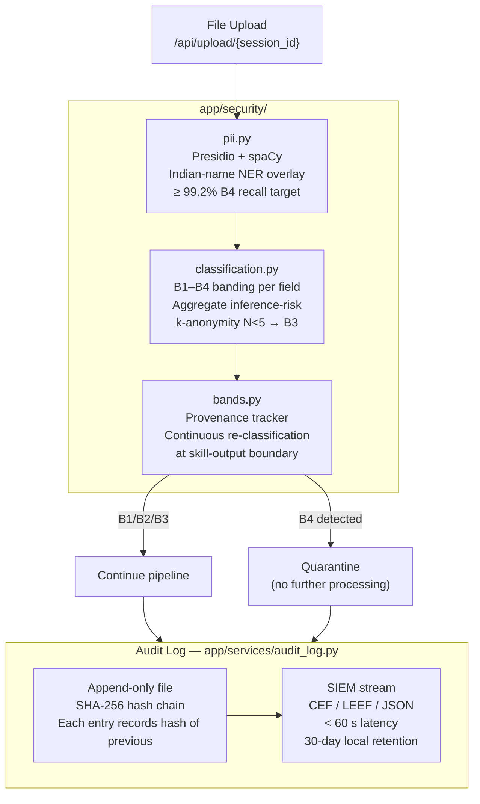

**Fig. 6 — Security Architecture: Classification, Quarantine, Audit Log**

> **Key Insight:** B4 data never leaves the app; quarantine prevents accidental exposure. Every operation is logged with SHA-256 hash chain for forensic integrity.

**Three Security Layers:**

**Layer 1: PII Detection (pii.py)**
- **Technology:** Presidio (named entity recognition) + spaCy (NLP) + Indian-name NER overlay
- **Target Recall:** ≥ 99.2% for B4 (restricted) classification
- **Scope:** Names, email addresses, phone numbers, Aadhaar/PAN patterns, supplier identities, bank details
- **Output:** Confidence scores per field; threshold-based classification

**Layer 2: Data Classification (classification.py)**
- **B1 (Public):** Aggregated metrics, peer benchmarks, non-sensitive category names
- **B2 (Internal):** Company spend totals, business unit names, non-sensitive supplier lists
- **B3 (Confidential):** Sensitive supplier names, cost details, customer identifiers (but tokenized for LLM use)
- **B4 (Restricted/PII):** Personal data, account numbers, medical information
- **k-anonymity Check:** If < 5 entities in a group, elevate to B3 (re-identification risk)
- **Aggregate Inference-Risk:** If combining fields could expose PII (e.g., rare job title + salary), escalate to B3

**Layer 3: Band Enforcement (bands.py)**
- **Provenance Tracking:** Record which fields contributed to which output
- **Continuous Re-classification:** Check every skill output boundary
  - If skill returns B1 field but input included B3 data → re-classify output to B3
- **LLM Pre-Call Gate:** B4 → quarantine; B3 → tokenize; B2/B1 → full text OK

**Audit Log Architecture (audit_log.py):**
- **Append-Only File:** Each event immutably written (no edit, only append)
- **Hash Chain Integrity:** Each entry records SHA-256(previous_entry) — if any entry modified, chain breaks
- **Events Logged:**
  - File upload (filename, size, session_id)
  - Skill execution (skill_name, input_band, output_band, LLM mode)
  - Initiative accept/reject (lever, CFO_user, reason)
  - Tear-down steps (infrastructure, memory, backups)
  - PII detection events (field, confidence, band_decision)
- **SIEM Integration:** Stream to client SIEM in CEF/LEEF/JSON format within 60 seconds
- **Retention:** 30 days local; client SIEM controls long-term retention

**Quarantine Mechanism:**
- **B4 Detection** → File tagged; no further processing
- **Escalation Alert** → Engagement lead + compliance officer notified
- **No Deletion** → Quarantined data retained in encrypted storage for audits; not processed by any skill

**Section Summary:**
- Three-layer security: PII detection → data classification → band enforcement
- Audit log with hash chain ensures forensic integrity and compliance
- SIEM integration streams events in real-time to client governance systems

**Next:** § 7 details the Data Model—the core structures that flow through the system.

---

## 7. Data Model

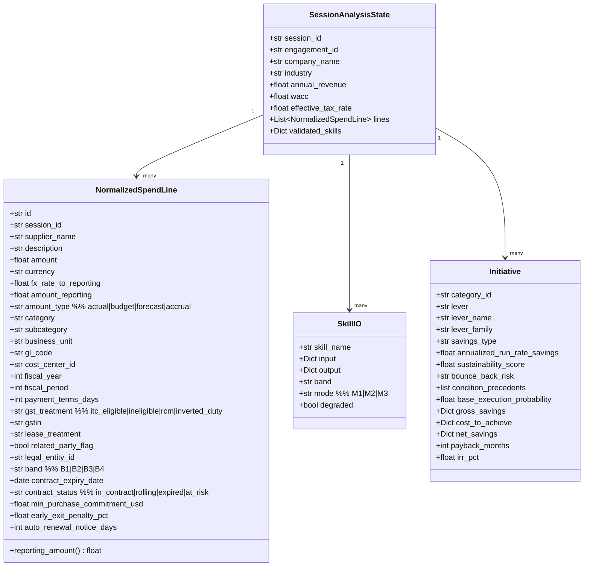

**Fig. 7 — Core Data Model Classes**

**Key Classes:**

**NormalizedSpendLine** (core unit of analysis)
- Represents one spend transaction (supplier payment, cost center allocation, etc.)
- Includes financial details (amount, currency, FX rate, reporting_amount property for multi-currency)
- Includes operational metadata (category, subcategory, GL code, cost center, business unit)
- Includes tax/compliance flags (GST treatment, related-party flag, lease treatment)
- Includes contract metadata (expiry, status, payment terms, early exit penalty)
- Classified to B1–B4 band during ingestion
- Used by: addressability engine, peer benchmarker, savings-modeler

**SessionAnalysisState** (engagement state container)
- Aggregates session metadata (engagement_id, company_name, industry)
- Stores session configuration (WACC, effective_tax_rate for financial modeling)
- Contains list of NormalizedSpendLines (typically 100–5M+ depending on scale tier)
- Tracks validated_skills (which skills have successfully completed)
- Persisted to memory store to enable multi-turn sessions

**SkillIO** (skill execution contract)
- Metadata wrapper around skill input/output
- Records execution mode (M1/M2/M3), output band classification
- Flags degradation (e.g., "peer-benchmarker unavailable in M1 mode")
- Used by OPAR Reflect phase to validate quality

**Initiative** (value lever opportunity)
- Represents one identified cost-reduction opportunity (e.g., "MRO consolidation")
- Calculated by savings-modeler from sector pack or universal lever
- Includes financial projections (gross/net savings, payback, tax-adjusted IRR)
- Includes risk metrics (sustainability_score, bounce_back_risk, base_execution_probability)
- Includes conditions for execution (condition_precedents list)
- Tracked through pipeline: proposed → accepted/rejected → implemented → calibrated

**Section Summary:**
- Four core classes model the flow from raw spend → validated session → skill outputs → value initiatives
- Data model supports FP&A features: multi-currency, fiscal periods, tax treatment, contract terms
- Metadata tracking enables audit trail and quality gates

**Next:** § 8 explains how Sector Packs provide industry-specific intelligence.

---

## 8. Sector Pack Architecture — 11 Full Packs

**Why This Matters:** Different industries face different cost pressures. Rather than one-size-fits-all, we've built 11 complete, industry-specific sector packs that codify consulting best practices for each sector. This is how the platform scales to 11 different verticals without manual customization.

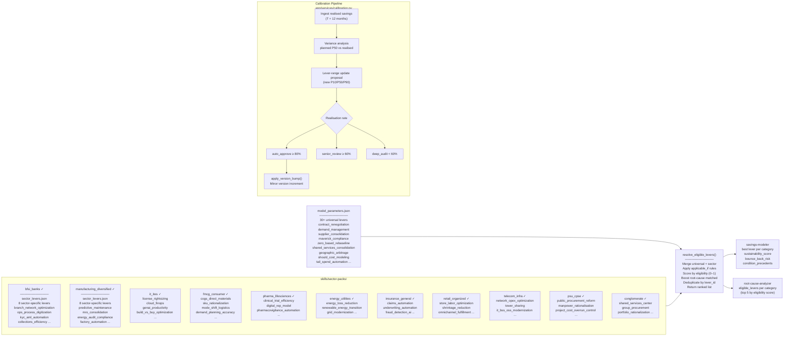

**Fig. 8 — Sector Pack Architecture & Calibration Loop**

**11 Sector Packs (All Complete):**

| Pack | Industry | Key Levers (Sample) |
|------|----------|-------------------|
| **bfsi_banks** | Banking, Financial Services | Branch network optimization, KYC/AML automation, collections efficiency, interest rate repricing, loan loss provisioning, treasury ops optimization |
| **manufacturing_diversified** | Discrete manufacturing, conglomerates | Predictive maintenance, MRO consolidation, energy audit, factory automation, procurement rationalization, supply chain optimization |
| **it_ites** | IT services, IT-enabled services | License rightsizing, cloud FinOps, GenAI productivity, build-vs-buy optimization, attrition reduction, offshore arbitrage |
| **fmcg_consumer** | Consumer goods, retail FMCG | COGS/direct materials, SKU rationalization, logistics mode shift, demand planning, promotional effectiveness, private label mix |
| **pharma_lifesciences** | Pharmaceuticals, biotech, CROs | Clinical trial efficiency, digital rep model, pharmacovigilance automation, supply chain rationalization, manufacturing footprint |
| **energy_utilities** | Power, gas, water | Energy loss reduction, renewable transition, grid modernization, O&M optimization, demand response programs |
| **insurance_general** | General insurance, health | Claims automation, underwriting automation, fraud detection AI, distribution channel optimization, reinsurance placement |
| **retail_organized** | Modern retail, e-commerce | Store labor optimization, shrinkage reduction, omnichannel fulfillment, private label, category rationalization |
| **telecom_infra** | Telecom, tower companies | Network OpEx optimization, tower sharing, IT/BSS/OSS modernization, workforce optimization, energy efficiency |
| **psu_cpse** | Public sector, state enterprises | Public procurement reform, manpower rationalization, project cost control, asset monetization, shared services consolidation |
| **conglomerate** | Multi-business groups | Shared services center, group procurement, portfolio rationalization, inter-company billing optimization |

**Lever Structure (per pack):**
- **lever_id** (unique key)
- **lever_name** (e.g., "MRO consolidation")
- **lever_family** (category, e.g., "Sourcing")
- **applicable_if** (conditions: "manufacturing" AND "spend_in_mro > $1M")
- **p10_savings, p50_savings, p90_savings** (percentile ranges for addressable spend)
- **sustainability_score** (0–1: structural permanence likelihood)
- **bounce_back_risk** ("low" / "medium" / "high")
- **condition_precedents** (required steps: "obtain_supplier_list", "negotiate_terms")
- **phasing_curve** ([Y1%, Y2%, Y3%] — savings realization by year)
- **cta_rate** (call-to-action conversion %: % of eligible companies that should pursue lever)
- **complexity_tier** ("quick_win" / "medium" / "complex")
- **implementation_weeks** (p10/p50/p90 effort estimate)

**Universal Levers (model_parameters.json):**
30+ levers applicable across all sectors:
- Contract renegotiation, demand management, supplier consolidation, maverick spend compliance
- Zero-based rebaseline, shared services consolidation, geographic arbitrage, should-cost modeling
- Tail spend automation, process automation (RPA), workforce optimization, footprint rationalization

**Lever Intelligence Engine (resolve_eligible_levers):**
1. **Load** sector pack (by industry) + universal levers
2. **Evaluate Signals** → cost categories match lever applicability rules?
3. **Eligibility Score** → 0.70 base + signal bonuses (+0.05 per match, +0.15 for root-cause match)
4. **De-duplicate** → if same lever in sector + universal, sector-specific wins
5. **Rank** → sort by descending eligibility_score
6. **Return** → list of eligible levers with all metadata

**Calibration Loop (app/services/calibration.py):**
Post-engagement (T+12 months), track actual vs. planned savings:
1. **Ingest Realised Savings** → Client provides actual cost reduction achieved
2. **Variance Analysis** → P50 estimated vs. realised actual; compute realization rate (%)
3. **Propose Updates** → Suggest new P10/P50/P90 ranges based on realised data
4. **Gate Decision:**
   - ≥ 80% realization → auto-approve version bump
   - 60–80% → senior review recommended
   - < 60% → deep audit required (investigate root causes)
5. **Version Bump** → If approved, increment pack version (v1.0 → v1.1) with updated ranges
6. **Feedback Loop** → Next engagement uses refined ranges; platform improves over time

**Section Summary:**
- 11 complete, industry-specific sector packs codify consulting best practices
- 30+ universal levers provide cross-industry options
- Lever Intelligence Engine resolves eligible levers per company (typically 8–12 top opportunities)
- Calibration loop continuously refines lever ranges based on realised outcomes

**Next:** § 9 explains the 4-Dimension Addressability Engine that calculates how much of each spend line is "addressable" (can be optimized).

---

## 9. Addressability Engine — 4-Dimension Model

**Why This Matters:** Not all spend can be optimized. A regulatory requirement (e.g., GST tax) can't be negotiated; a contract expires in 3 years, so switching costs may outweigh savings. The Addressability Engine applies four constraints to calculate the true addressable spend per line.

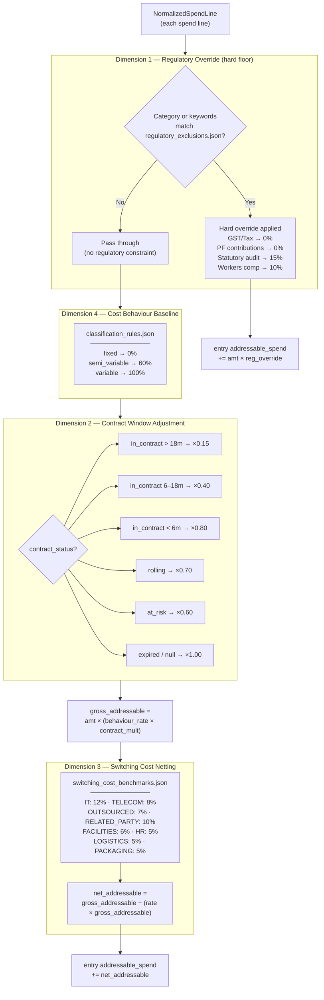

**Fig. 9 — 4-Dimension Addressability Engine**

**Four Dimensions Explained:**

**Dimension 1: Regulatory Override (hard floor)**
- GST tax, PF contributions, statutory audit fees, workers' compensation insurance → can't be negotiated
- Regulatory exclusions matched by category keyword
- If matched: addressable amount = original amount × override_rate (e.g., statutory audit 15% addressable, 85% non-addressable)

**Dimension 2: Contract Window Adjustment (time until flexibility)**
- Long contract (> 18 months) → low flexibility → ×0.15 multiplier (15% addressable; 85% locked)
- Medium contract (6–18 months) → some flexibility → ×0.40
- Short contract (< 6 months) → high flexibility → ×0.80
- Rolling contract → flexibility but churn risk → ×0.70
- At-risk contract (early termination clauses triggered) → limited by penalty → ×0.60
- Expired / no contract → full flexibility → ×1.00

**Dimension 3: Switching Cost Netting (cost to switch)**
- Even if negotiation succeeds, switching to new supplier has costs: setup, training, quality assurance, etc.
- Rates vary by category (IT 12%, Telecom 8%, Outsourced 7%, Related-Party 10%, etc.)
- Calculation: net_addressable = gross_addressable − (switching_cost_rate × gross_addressable)
- Example: ₹100 spend in IT category, 50% negotiable → ₹50 gross_addressable, but 12% switching cost → ₹44 net

**Dimension 4: Cost Behaviour Baseline (volume variability)**
- Fixed costs (rent, insurance, salaries) don't change with volume → 0% addressable for demand-driven levers
- Semi-variable (utilities, consumables) → 60% addressable
- Variable (commissions, raw materials) → 100% addressable
- Applied first (multiplies with contract window)

**Calculation Order:**
1. Start with line amount
2. Apply cost behaviour baseline (fixed/semi-variable/variable)
3. Apply regulatory override (if applicable)
4. Apply contract window adjustment
5. Apply switching cost netting
6. Result = final addressable_spend for that line

**Example Calculation:**
- Line: ₹100 for IT outsourced services, fixed cost, 12-month contract
- Dim 4 (behaviour): ₹100 × 0% (fixed) = ₹100 addressable
- Dim 1 (regulatory): No override; continue
- Dim 2 (contract): 12-month → ×0.40 = ₹40 gross_addressable
- Dim 3 (switching): ₹40 − (12% × ₹40) = ₹35.20 net_addressable
- **Final:** ₹35.20 addressable out of ₹100

**Section Summary:**
- Four dimensions apply sequential constraints to calculate true addressable spend
- Accounts for regulatory mandates, contract flexibility, switching costs, and cost behaviour
- Enables realistic savings estimates (not just potential, but achievable)

**Next:** § 10 explains the Lever Intelligence Engine that resolves which specific levers apply to each company.

---

## 10. Lever Intelligence Engine

**Why This Matters:** Knowing 30+ levers is useless if you recommend the wrong ones to a company. The Lever Intelligence Engine infers industry from spend signals, then resolves the most relevant levers with eligibility scoring. This is how the platform scales to diverse customers without manual configuration.

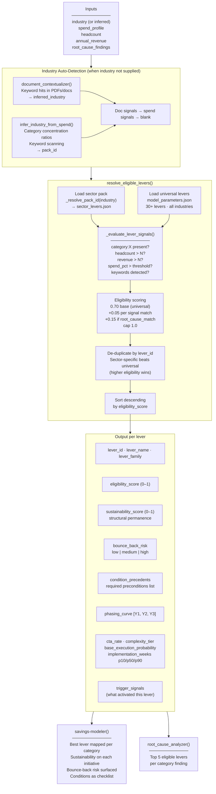

**Fig. 10 — Lever Intelligence Engine: Industry Inference & Eligibility Scoring**

**Phase 1: Industry Auto-Detection**
- **Document Signals** — If PDFs uploaded, keyword scanning (e.g., "KYC", "AML" → BFSI; "SKU", "FMCG" → FMCG)
- **Spend Signals** — Category concentration ratios + keyword matching in supplier/description fields
  - E.g., > 30% spend in "Manufacturing" + "IT" categories, keywords like "factory" → likely Manufacturing
- **Priority:** Doc signals > spend signals > blank (ask user)

**Phase 2: resolve_eligible_levers()**

**Step 1: Load Packs**
- Load sector pack (8–9 levers) + universal pack (30+ levers)

**Step 2: Evaluate Signals**
- For each lever's `applicable_if` condition:
  - Is category:X present in spend profile? ✓/✗
  - Is headcount > threshold? ✓/✗
  - Is revenue > threshold? ✓/✗
  - Is spend% > minimum? ✓/✗
  - Are keywords in supplier/description? ✓/✗

**Step 3: Eligibility Scoring**
- Base score: 0.70 (universal levers), 0.75 (sector levers)
- Per signal match: +0.05
- Root-cause match (if root-cause-analyzer found this category as cost driver): +0.15
- Cap at 1.0
- Example: Manufacturing company, MRO category has cost driver flag
  - MRO consolidation lever: 0.75 + 0.05 + 0.05 + 0.15 = 1.0 ✓

**Step 4: De-Duplicate**
- If same lever in sector + universal, keep sector-specific version (higher eligibility typically)

**Step 5: Sort & Rank**
- Descending by eligibility_score
- Return top 10–15 (or all ≥ 0.70)

**Output per Lever:**
1. **lever_id, lever_name, lever_family** — Unique identifier and human labels
2. **eligibility_score (0–1)** — Confidence in relevance to this company
3. **sustainability_score (0–1)** — Long-term structural permanence (e.g., "contract renegotiation" high; "force-reduction" low—behavioral reversion risk)
4. **bounce_back_risk** — Classification of behavioral reversion likelihood
5. **condition_precedents** — Checklist of required preconditions (e.g., "obtain_supplier_list", "conduct_should_cost_analysis")
6. **phasing_curve** — [Y1%, Y2%, Y3%] realized savings by year
7. **complexity_tier, implementation_weeks (p10/p50/p90), cta_rate** — Effort and adoption likelihood
8. **trigger_signals** — Which conditions activated this lever (for transparency)

**Feeding Into Downstream Skills:**
- **savings-modeler()** → maps best lever per category, calculates NPV/payback, flags sustainability/bounce-back risk
- **root-cause-analyzer()** → returns top 5 eligible levers per category finding (e.g., "Category XYZ is 2× peer median → suggests MRO consolidation, contract renegotiation")

**Section Summary:**
- Industry inference removes manual data entry; platform auto-detects vertical
- Eligibility scoring weights levers by relevance, root-cause matches, and company signals
- Output feeds financial modeling and root-cause analysis downstream

**Next:** § 11 explains sensitivity scenarios for stress-testing business cases.

---

## 11. Sensitivity Analysis — 7 Scenarios

**Why This Matters:** A P50 savings estimate (50th percentile) is one point estimate. But CFOs need confidence ranges. What if execution is delayed? What if only top levers succeed? What if savings revert? The platform runs 7 scenarios to stress-test the base case.

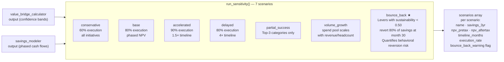

**Fig. 11 — 7-Scenario Sensitivity Model**

**Seven Scenarios:**

| Scenario | Execution | Timeline | Assumption |
|----------|-----------|----------|-----------|
| **1. Conservative** | 60% | Normal | All initiatives succeed at 60% of P50 level |
| **2. Base** | 80% | Normal (phased) | Planning baseline; drives NPV calculation |
| **3. Accelerated** | 90% | 1.5× speed | Aggressive execution (pulls realization forward) |
| **4. Delayed** | 80% | 4× timeline | Implementation delays; extends payback period |
| **5. Partial** | 80% | Normal | Only top-3 by NPV categories succeed |
| **6. Volume Growth** | 80% | Normal | Cost pool scales with revenue/headcount growth (offsets savings) |
| **7. Bounce-Back** ★ | 80% | Normal + reversion | Levers with sustainability < 0.50 revert 80% at month 30 (behavioral reversion risk) |

**Output per Scenario:**
- **savings_3yr** — 3-year cumulative savings (actual amount)
- **npv_pretax, npv_aftertax** — Net present value; tax-adjusted using effective_tax_rate
- **timeline_months** — Duration to full realization
- **execution_rate** — % of planned leverage point achieved
- **bounce_back_warning** — Flag if any leverage reverts post-month 24

**Bounce-Back (Scenario 7) Deep-Dive:**
- Sustainability score < 0.50 indicates behavioral reversion risk (e.g., "cost reduction that requires constant discipline")
- Model assumes 80% of savings reverts at month 30 (9M after full realization)
- Example: "Reduce discretionary travel" with sustainability 0.40
  - Year 1: ₹10 Cr savings (realized)
  - Year 3: 80% reverts → only ₹2 Cr net remains
  - 3-year total: ₹10 + ₹10 + ₹2 = ₹22 Cr (not ₹30 Cr)

**Use Cases:**
- **Board Presentation:** Show all 7 scenarios; let CFO pick risk tolerance
- **Engagement Scope:** Conservative scenario → most achievable; Base → planning target; Accelerated → upside case
- **Risk Register:** Bounce-back scenario → identifies which levers are "at risk" and require governance

**Section Summary:**
- Seven scenarios stress-test base case across execution, timing, and structural permanence
- Bounce-back scenario quantifies behavioral reversion risk for sustainability-weak levers
- Output enables data-driven risk discussions with CFO

**Next:** § 12 explains scale tiers for handling different data volumes.

---

## 12. Scale Tiers — Mid-Cap, Large-Cap, Conglomerate

**Why This Matters:** A 50k-line spend file needs a different infrastructure than a 5M-line file. This section explains how the platform scales storage, caching, and filtering performance across three tier levels.

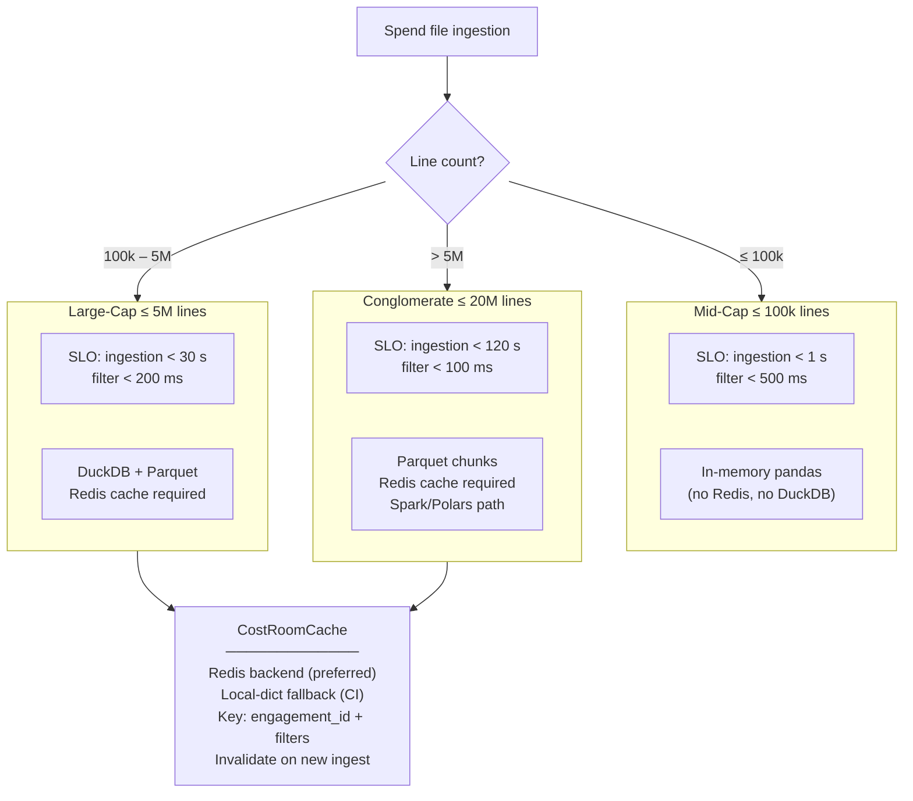

**Fig. 12 — Scale Tiers & Storage Strategy**

**Tier 1: Mid-Cap (≤ 100k lines)**
- **Storage:** In-memory pandas DataFrame (no external DB)
- **Caching:** Optional; in-process dict if no Redis
- **Ingestion SLO:** < 1 second
- **Filter SLO:** < 500 ms (cost-room queries)
- **Use Case:** SMB companies, divisions of large corps
- **Example:** ₹50 Cr annual spend, 3 years history = 50k lines

**Tier 2: Large-Cap (≤ 5M lines)**
- **Storage:** DuckDB + Parquet columnar format
- **Caching:** Redis required; key = (engagement_id + filter_hash)
- **Ingestion SLO:** < 30 seconds (streaming ingest per file chunk)
- **Filter SLO:** < 200 ms (Redis cache hit)
- **Use Case:** Large corporations, enterprise clients
- **Example:** ₹500 Cr annual spend, 3 years, detailed line-item data = 2M lines

**Tier 3: Conglomerate (≤ 20M lines)**
- **Storage:** Parquet chunks (split by business unit/time period); optional Spark/Polars for aggregations
- **Caching:** Redis required; lazy-load filters
- **Ingestion SLO:** < 120 seconds (parallel chunk loading)
- **Filter SLO:** < 100 ms (Redis cache; fallback to DuckDB join)
- **Use Case:** Multi-company conglomerates, holding companies
- **Example:** ₹5000 Cr+ consolidated spend, 10+ subsidiaries = 10M+ lines

**Cost-Room Cache Strategy:**
- **Key:** `engagement_id + filter_spec_hash` (category, business_unit, supplier, cost_center)
- **Invalidation:** On new ingest, flush all keys for engagement_id (ensures fresh data)
- **TTL:** 1 hour (or until ingest)
- **Fallback:** In-process dict in CI/local (when Redis unavailable)

**Section Summary:**
- Three scale tiers handle 100K to 20M+ spend lines
- Storage, caching, and SLO strategy varies by tier
- Cost-room cache keeps filter queries sub-200ms even for large datasets

**Next:** § 13 details deployment architectures for AWS, Azure, and on-prem.

---

## 13. Deployment Architectures

**Why This Matters:** OpEx Intelligence can run on three clouds or on-prem. Each deployment has different security, compliance, and operational requirements. This section maps the architecture to AWS Mumbai, Azure Central India, and on-prem Ansible.

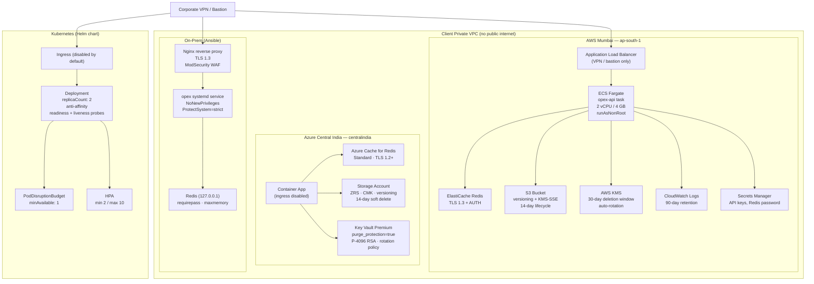

**Fig. 13 — Deployment Architectures: AWS, Azure, On-Prem, K8s**

**AWS Mumbai (ap-south-1):**
- **Compute:** ECS Fargate (serverless containers, no server management)
- **Load Balancer:** Application Load Balancer (VPN/bastion only access)
- **Cache:** ElastiCache Redis (TLS 1.3, AUTH required)
- **Storage:** S3 (versioning enabled, KMS-SSE encryption, 14-day lifecycle policy)
- **Secrets:** AWS Secrets Manager (auto-rotation policy)
- **Logs:** CloudWatch (90-day retention, encrypted)
- **Key Management:** AWS KMS (30-day deletion window, rotation policy)
- **RTO/RPO:** RTO 30 min (ECS restart), RPO 24 hours (nightly S3 backups)
- **Cost:** ~₹1.5–3 Lakh/month (2 vCPU, 4 GB RAM, 100 GB storage)

**Azure Central India (centralindia):**
- **Compute:** Container Apps (managed Kubernetes alternative)
- **Cache:** Azure Cache for Redis (Standard tier, TLS 1.2+)
- **Storage:** Storage Account (ZRS for 3-region replication, CMK encryption, 14-day soft-delete)
- **Secrets:** Key Vault Premium (purge_protection=true, P-4096 RSA keys, rotation policy)
- **Logs:** Application Insights (integrated monitoring)
- **Data Residency:** Guaranteed centralindia region (Pune data centre)
- **RTO/RPO:** RTO 30 min, RPO 24 hours
- **Cost:** ~₹1.5–3 Lakh/month (similar to AWS)

**On-Prem (Ansible):**
- **Web Server:** Nginx (reverse proxy, TLS 1.3, ModSecurity WAF)
- **App:** opex-api as systemd service (NoNewPrivileges, ProtectSystem=strict, CapabilityBoundingSet)
- **Cache:** Redis (127.0.0.1, requirepass set, maxmemory policy)
- **Storage:** Local filesystem (encrypted LVM, daily backups to cold storage)
- **OS:** Ubuntu 22.04 LTS (hardened with Ansible playbooks)
- **RTO/RPO:** RTO 5 min (systemd restart), RPO < 1 hour (cron backup)
- **Compliance:** Full customer control; no external data egress (M3 LLM mode for all skills)

**Kubernetes (Helm chart):**
- **Deployment:** 2 replicas (anti-affinity ensures different nodes)
- **Pod Disruption Budget:** minAvailable: 1 (graceful scaling)
- **Horizontal Autoscaling:** min 2, max 10 replicas (CPU/memory triggered)
- **Ingress:** Disabled by default; enable only if behind WAF
- **Probes:** readiness (every 10s), liveness (every 30s)
- **Storage:** Persistent Volume Claim (for logs, memory store, audit log)
- **RBAC:** Service account with read-only access to ConfigMaps, no access to secrets

**Tear-Down Procedure (post-engagement):**
1. Advisory IaC destroy (terraform destroy / helm uninstall)
2. Pack-locks sweep (remove engagement lock files)
3. Memory scope sweep (delete engagement/session memory entries)
4. Calibration export (save final calibration report)
5. Calibration sweep (delete calibration pipeline data)
6. Audit log archive (export audit log, manually transfer to client SIEM)
7. Backup sweep (delete engagement-specific backups)
8. Laptop DLP checklist (manual verification—no consultant has local copies)
9. Cloud-tag verification (confirm zero_residual tag applied)
10. Generate attestation (signed SHA-256 hash of empty state)

**Section Summary:**
- Three cloud options (AWS, Azure) + on-prem provide flexibility for different compliance/data residency needs
- Kubernetes deployment enables container orchestration at scale
- Tear-down procedure ensures zero-residual data post-engagement

---

## Appendices

### **Appendix A: Technology Stack Reference**

| Layer | Component | Version | Purpose |
|-------|-----------|---------|---------|
| **Framework** | FastAPI | 0.116.0 | REST API, async/await, OpenAPI docs |
| **Runtime** | Python | 3.11 | Type hints, dataclasses, functional patterns |
| **Web Server** | Uvicorn | 0.35.0 | ASGI server; Nginx reverse proxy (TLS) |
| **Data Processing** | Pandas | 2.3.1 | Spend line parsing, filtering, aggregation |
| **Large Data** | DuckDB / Parquet | 0.9.0 / 2.1.0 | Columnar storage for >100k lines |
| **Documents** | python-docx | 1.2.0 | DOCX export (board decks, business cases) |
| **Documents** | pypdf | 6.7.1 | PDF parsing, extraction |
| **LLM** | Anthropic SDK | 0.83.0 | Claude API (M2 mode), zero-retention |
| **LLM** | Ollama | (client-deployed) | Local inference (M3 mode) |
| **PII Detection** | Presidio | 0.15.0 | Named entity recognition (PII) |
| **NLP** | spaCy | 3.7.0 | Language model, Indian-name NER overlay |
| **Vectors** | Qdrant | 1.9.2 | Vector DB for semantic memory search |
| **Embeddings** | sentence-transformers | 3.0.1 | Text embeddings for memory indexing |
| **Caching** | Redis | 7.2 | Cost-room filter cache, session state |
| **Rate Limiting** | slowapi | 0.1.9 | API throttling (100 req/min auth, 10 unauth) |
| **Testing** | pytest | 8.4.1 | Unit, integration, contract, performance tests |
| **Secrets** | python-dotenv | 1.0.0 | Environment variable management |

---

### **Appendix B: File Organization & Key Modules**

| Component | Path | Key Files | Responsibility |
|-----------|------|-----------|-----------------|
| **API** | `/app/main.py` | main.py (66 KB) | FastAPI app, 60+ endpoints, auth middleware |
| **OPAR** | `/app/opar/` | orchestrator.py, observe.py, plan.py, act.py, reflect.py, quality.py, provenance.py | Agentic loop orchestration |
| **Skills** | `/app/skills/` | engine.py (skill dispatcher), registry.py (discovery), model_contextualizer.py | Skill execution, versioning, context prep |
| **Security** | `/app/security/` | pii.py, classification.py, bands.py, audit_log.py | PII detection, data classification, audit trail |
| **Services** | `/app/services/` | ingestion.py, analysis.py, pipeline.py, benchmarks.py, business_case.py, calibration.py, tear_down.py | Business logic (27 modules) |
| **Sector Packs** | `/skills/sector-packs/` | 11 directories + sector_levers.json per pack | Industry-specific lever libraries |
| **Reference Data** | `/skills/*/references/` | model_parameters.json, switching_cost_benchmarks.json, regulatory_exclusions.json | Addressability rules, universal levers |
| **Memory** | `/app/memory.py` | memory.py (JSON file-backed, optional Mem0) | Session/engagement/user context persistence |
| **Frontend** | `/frontend/` | React SPA (`src/pages/`), build output `dist/` | Procurement chat, diagnostic, cost room, skills admin |
| **Tests** | `/tests/` | eval/, sample_data/ | Unit, integration, contract, performance tests |
| **Infrastructure** | `/deploy/` | terraform/, helm/, ansible/ | IaC for AWS, Azure, on-prem |

---

### **Appendix C: Engagement Lifecycle & Calibration**

**12-Week Engagement Cycle:**
- **Week 1:** Engagement kickoff, data schema alignment, industry confirmation
- **Weeks 2–4:** Initial OPAR loop, spend discovery, peer benchmarking, cost anomaly identification
- **Weeks 5–8:** Value lever identification (10–15 levers per company), business case development, scenario modeling
- **Weeks 9–11:** CFO review, initiative acceptance/rejection, final refinement
- **Week 12:** Delivery (board deck, cost room, MOR pack), knowledge transfer, tear-down prep
- **T + 12 Months:** Calibration cycle (realised savings vs. plan, lever range updates, pack version bump)

**Calibration Triggers:**
- Realisation rate ≥ 80% → auto-approve lever-range update (new v1.1)
- 60–80% → senior review before approval
- < 60% → deep audit (investigate root causes, recommend adjustments)

**Tear-Down Verification (Post-Engagement):**
1. ✓ Infrastructure deprovisioned (IaC destroy)
2. ✓ Memory scopes cleaned (no engagement data in memory store)
3. ✓ Pack locks removed (sector pack restored for next engagement)
4. ✓ Calibration exported (narrative snapshot saved)
5. ✓ Backups deleted (except audit log archive)
6. ✓ Audit log archived to client SIEM
7. ✓ Consultant laptops DLP-verified (no local copies)
8. ✓ Cloud resources tagged zero_residual
9. ✓ Attestation signed & stored (immutable proof of deletion)

---

## Glossary

**Addressability Engine:** Four-dimensional model (regulatory override, contract window, switching cost, cost behaviour) that calculates how much of each spend line can be optimized.

**OPAR Loop:** Observe-Plan-Act-Reflect agentic orchestration pattern. Iterative cycle allowing the platform to refine recommendations as data emerges.

**Sector Packs:** Industry-specific lever libraries. 11 complete packs (BFSI, Manufacturing, IT/ITeS, FMCG, Pharma, Energy, Insurance, Retail, Telecom, PSU, Conglomerate) codifying consulting best practices.

**Lever Intelligence Engine:** Auto-detects industry and resolves eligible cost-reduction opportunities. Outputs ranked list of levers with eligibility scores.

**B1–B4 Classification:** Data sensitivity bands. B1=Public, B2=Internal, B3=Confidential (tokenized only), B4=Restricted/PII (no LLM, quarantine).

**Gate-2 Promotion:** Quality threshold (AssumptionQualityScore ≥ 0.65) for initiative progression to CFO review. Prevents low-confidence recommendations reaching decision-makers.

**M1/M2/M3 Modes:** LLM deployment options. M1=Deterministic (no LLM), M2=Cloud India region (zero-retention), M3=On-prem Ollama.

**Skill Engine:** Modular, versioned library of 26 callable operations across 8 groups. Easy to extend without modifying core OPAR orchestration.

**Tear-Down:** Complete data retention wipe post-engagement. 9-step process ensuring zero-residual attestation.

**DAG (Directed Acyclic Graph):** Skill dependency ordering in OPAR Plan phase. Enables parallel execution within constraints.

**PII (Personally Identifiable Information):** Protected by Presidio + spaCy + Indian-name NER overlay. Target ≥99.2% recall for B4 classification.

**SIEM, CEF, LEEF:** Security event logging standards. Platform streams audit log to client SIEM in CEF/LEEF/JSON format within 60 seconds.

**Phasing Curve:** Timeline for implementing a value lever. Expressed as [Y1%, Y2%, Y3%]—percentage of total savings realized each year.

**Sustainability Score:** Long-term viability rating (0–1) for each lever. 1.0 = highly structural; 0.0 = high reversion risk.

**Bounce-Back Risk:** Classification of behavioral reversion likelihood (low/medium/high). Incorporated into Scenario 7 (Bounce-Back) sensitivity analysis.

**Addressable Spend:** Amount of spend that can be optimized after applying four dimensions (regulatory, contract window, switching cost, cost behaviour).

**Cost Room:** Interactive dashboard filtering spend by category, business unit, supplier, cost center. SLO: < 200 ms filter latency.

**Initiative:** Identified cost-reduction opportunity mapped to a lever. Tracked through pipeline (proposed → accepted → implemented → calibrated).

**Calibration Pipeline:** Post-engagement process (T+12M) comparing realised vs. planned savings; proposes sector pack lever range updates based on realisation rate.

---

## Document Navigation

- **For executives:** Start with Executive Summary + Use Cases (§ 1A); skim Section Summaries
- **For architects:** Read full document with focus on §§ 2, 3, 6, 9, 10, 13
- **For security teams:** Focus on § 6 (Security Architecture) + Appendix C (Tear-Down)
- **For implementation:** Reference Appendix B (File Organization) + § 13 (Deployment)

---

**End of Architecture Documentation v3.0**
